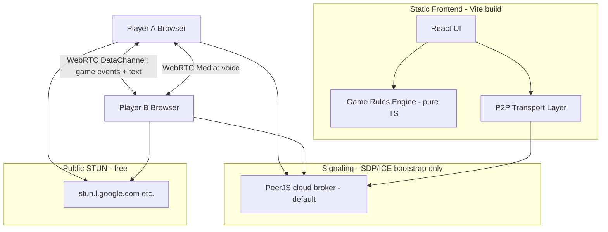

# Guess Who — Product Requirements Document

## Summary

A standalone browser-based **2-player Guess Who** game with real-time **voice chat**, **text chat**, and **peer-to-peer game synchronization**. Players create or join a room via a shareable link with a 6-character room code. No traditional application backend (REST API, database, or authoritative game server) is required; a **minimal signaling channel** is needed only to bootstrap WebRTC connections.

## Goals

- Deliver the classic Guess Who experience for two remote players in a browser.
- Connect voice and text automatically when the second player joins.
- Keep hosting costs near zero: static frontend; default **PeerJS cloud broker** (no self-hosted signaling required).
- Separate game rules (pure logic) from UI and networking (framework glue).

## Non-goals (v1)

- More than 2 players in one room.
- Accounts, login, matchmaking, or persistent game history.
- Mobile native apps.
- Championship series (best-of-5).
- Spectator mode.
- AI opponent.

## Users

- **Host** — creates a room, shares the link, waits for opponent, plays.
- **Guest** — opens shared link (or enters room code), connects, plays.

## Classic Guess Who Rules (Implementation Reference)

Source: [Hasbro official rules](https://instructions.hasbro.com/en-us/instruction/guess-who-classic-game), [Winning Moves PDF](https://winning-moves.com/images/guesswho%20rules.pdf).

### Setup

1. Each player has an identical roster of **24 characters**, each with a fixed set of visual traits (hair color, glasses, hat, facial hair, etc.).
2. Each player **secretly** selects one character as their **Mystery Person**. The opponent must not see this selection.
3. All character tiles start **face-up** (open) on each player's own board.
4. Determine who goes first via **coin flip** (host runs flip after both players are ready; result synced to guest).

### Turn structure

On your turn, choose **exactly one**:

1. **Ask a yes/no question** about the opponent's Mystery Person (e.g. "Does your person wear glasses?"), **or**
2. **Make a final guess** naming a specific character.

You may not do both on the same turn.

### After asking a question

- Opponent answers **honestly** with "yes" or "no" only.
- The asker **eliminates** characters on **their own board** by flipping tiles face-down:
  - If answer is **yes** → flip down characters that do **not** have the trait.
  - If answer is **no** → flip down characters that **do** have the trait.
- Turn ends; opponent's turn begins.

**Important:** Board eliminations are **local and private**. Each player only flips tiles on their own board. The opponent does not see which tiles you have eliminated.

### Guessing

- On your turn, instead of asking, you may guess: "The mystery person is [Name]."
- **Correct guess → you win.**
- **Incorrect guess → you lose immediately** (opponent wins).

### Game end

- A player wins by correct guess, or wins by default when the opponent guesses incorrectly.
- No further turns after a guess is resolved.

### Digital adaptations

| Physical rule | Digital behavior |
|---|---|
| Secret card in holder | Mystery selection UI hidden from opponent; only `mysteryId` hash or opaque ready signal sent over P2P |
| Flip tiles on your board | Local UI state only; **manual flip only** (no auto-elimination); not synced to opponent |
| Verbal yes/no | Synced answer event + optional text/voice; structured `yes`/`no` buttons for host/guest answering |
| Verbal guess | Structured guess action with character id; opponent client validates against their mystery |

## Feature Requirements

### Landing page

- Two primary actions: **Create Game** and **Join Game**.
- Brief explanation of how to play (optional, minimal).

### Create Game flow

1. Generate random **6-character** room code from `A–Z` and `2–9` only (e.g. `A3K9M2`); excludes ambiguous `0`/`O`/`1`/`I` to keep codes simple to read and share.
2. Navigate to game URL containing the code: `/play/:roomCode` or `?room=:roomCode`.
3. Show **shareable room link**, **Share** button (`navigator.share` when available), and **Copy** button (clipboard API).
4. Show waiting state until guest connects.
5. On guest join: auto-start voice, text chat, and game session layout.

### Join Game flow

1. From landing: enter room code manually, or open shared link directly.
2. Validate code format; show error for invalid codes.
3. Connect to host via signaling + WebRTC.
4. On success: show both player boards, chat, and voice controls.

### Character board

- Display 24 characters in a grid with **original Hasbro-style custom illustrations** (see ADR 003) — this is the visual core of the product.
- Click/tap toggles tile **open ↔ closed** (face-up ↔ face-down).
- Closed tiles show a card-back pattern (physical-game flip feel).
- **Manual elimination only** — the app never auto-flips tiles after questions/answers; players flip themselves like the physical game.
- Mystery Person selection mode: pick one character before game starts (selection hidden from peer).

### Text chat

- Send/receive text messages in real time between players.
- Messages timestamped; scrollable history.
- Game events (questions, answers) may also appear in chat log.

### Voice chat

- Live bidirectional audio when connected.
- Mute/unmute self; visual indicator of connection state.
- Request microphone permission with clear UX on denial.

### Game rules enforcement

- Enforce turn order, one action per turn, yes/no answers only, guess win/lose.
- Prevent selecting eliminated characters as guess targets (optional UX guard).
- Show whose turn it is, game phase, and outcome screen.

## Architecture

### High-level diagram



### Recommended tech stack

| Layer | Choice | Rationale |
|---|---|---|
| Framework | React 18+ / TypeScript | Per `AGENTS.md` |
| Build tool | **Vite** | Fast dev, first-class TS, Vitest integration |
| Routing | **react-router-dom** | `/`, `/play/:roomCode`, `/join` |
| Testing | **Vitest** + **React Testing Library** | Matches Vite; unit test rules engine thoroughly |
| Styling | **CSS Modules** | No extra dependency; component-scoped styles |
| WebRTC / P2P | **PeerJS client SDK** (`peerjs`) behind `P2PConnection` | Data + voice over P2P after handshake; see ADR 001 |
| Signaling | **PeerJS cloud broker** (`0.peerjs.com`) by default | `npm run dev` only; optional self-hosted PeerServer via `VITE_SIGNALING_URL` |
| ICE | Public STUN servers | Free; sufficient for many home networks |
| TURN | Metered / Twilio free tier / self-hosted coturn | **Included from v1** via env credentials |
| Character art | Original SVG portraits (ADR 003) | Hasbro-inspired style; 24 custom illustrations |

**Alternatives considered:** Native `RTCPeerConnection` + self-hosted PeerServer (legacy in `webrtcConnection.ts`); `simple-peer` — both need more custom signaling glue than PeerJS cloud for link-based join UX.

### Layering

```
src/
  domain/          # Game rules, character roster, message types (no React)
  transport/       # Signaling client, WebRTC peer connection, data-channel protocol
  features/        # create-game, join-game, board, chat, voice, gameplay
  pages/           # Landing, Play
  components/      # Shared UI
```

Business logic lives in `domain/` and is tested without browser APIs. `transport/` isolates WebRTC/signaling behind a narrow interface so signaling provider can change without touching rules.

### P2P message protocol (overview)

JSON messages over a single ordered `RTCDataChannel`:

| Type | Direction | Purpose |
|---|---|---|
| `chat` | bidirectional | Text chat |
| `ready` | bidirectional | Player ready with mystery selected |
| `coin-flip` | host → guest | Coin flip result (`host` or `guest` goes first) |
| `game-start` | host → guest | Turn order from coin flip |
| `question` | asker → answerer | Yes/no question text |
| `answer` | answerer → asker | `yes` or `no` |
| `guess` | guesser → opponent | Character id guess |
| `guess-result` | opponent → guesser | `correct` or `incorrect` |
| `turn` | bidirectional | Explicit turn handoff (derived from events) |
| `peer-state` | bidirectional | Connection metadata |

Board flip state is **never** transmitted.

Voice uses PeerJS `MediaConnection` (separate from the game `DataConnection`); media is still P2P after signaling.

### Room identity

- Room code = 6 alphanumeric characters, generated client-side with `crypto.getRandomValues`.
- Host peer registers on the broker with id `guesswho-{ROOM_CODE}` (prefix avoids collisions on shared cloud broker).
- Guest connects to that peer id.
- URL is the join mechanism: `https://<origin>/play/<roomCode>`.

## Backend Necessity Assessment

### Verdict

| Capability | Custom backend required? | Notes |
|---|---|---|
| Static UI hosting | No | CDN/static host only |
| Game rules & logic | No | 100% client-side |
| Board eliminations | No | Local-only state |
| Text chat | No | WebRTC DataChannel |
| Voice chat | No | WebRTC media tracks |
| Game event sync | No | WebRTC DataChannel |
| **WebRTC signaling (SDP/ICE exchange)** | **Yes — unavoidable** | WebRTC has no built-in peer discovery |
| NAT traversal (STUN) | No (third-party) | Public STUN servers |
| NAT traversal (TURN) | Sometimes | ~10–20% of networks; hosted TURN may be needed for reliability |

**Conclusion:** A **traditional backend is not required**. A **minimal signaling server** (or managed signaling SaaS) **is required** for production-quality auto-connect when players open a link. Manual copy-paste SDP exchange is zero-server but unacceptable UX for this product.

### Minimal signaling approach (decided — ADR 001)

- **Default:** PeerJS cloud broker — no local signaling process; dev is `npm run dev` only.
- **Optional:** Self-hosted PeerServer in `signaling/` when `VITE_SIGNALING_URL=localhost:9000` (or custom host).
- `VITE_SIGNALING_URL` unset or `cloud` → public broker; legacy native transport may still use `VITE_TURN_*` for TURN.
- Broker relays SDP/ICE only; game state, chat, and voice do not pass through the broker.

No database, authentication service, or game state server is needed. The host browser is the **session authority** for room creation; first peer to claim a room code wins (acceptable for casual 2-player links).

### What we explicitly do NOT build

- REST API for game state
- WebSocket game server relaying every move
- User accounts or room persistence beyond the live session

## Deployment

- **Frontend:** Static deploy (Vercel, Netlify, GitHub Pages, Cloudflare Pages).
- **Signaling:** PeerJS cloud by default (zero deploy); optional self-hosted PeerServer for private broker.
- **HTTPS required** for `getUserMedia` and WebRTC in production.

## Testing Strategy

- **Unit tests:** Game rules engine, room code generation, message protocol parsing, turn/win/lose logic.
- **Component tests:** Board flip, landing page, create/join flows (mock transport).
- **Integration / manual:** Two-browser tab test for WebRTC connect, voice, chat, full game (automating WebRTC in CI is out of scope for v1).

## Risks & Mitigations

| Risk | Mitigation |
|---|---|
| WebRTC fails behind strict NAT | Public STUN; document TURN fallback; connection error UX |
| Host closes tab — room dies | Expected for P2P; show "host disconnected" message |
| Strict NAT blocks P2P | TURN credentials from v1; clear connection-error UX |
| Microphone denied | Graceful degradation; text-only mode still works |
| Cheating (lying about answers) | Same as physical game; trust model acceptable for casual play |

## Resolved Decisions

| # | Question | Decision |
|---|---|---|
| 1 | Who goes first? | **Coin flip** — host runs animated flip after both ready; result synced via P2P |
| 2 | Signaling approach? | **PeerJS cloud broker** default (ADR 001); optional self-hosted PeerServer in `signaling/` |
| 3 | Character visuals? | **Original Hasbro-style custom illustrations** — 24 SVG portraits; see ADR 003 |
| 4 | Auto-flip after answers? | **No** — manual flip only, like the physical game |
| 5 | Room code charset? | **Simple:** `A–Z` + `2–9` only; no `0`/`O`/`1`/`I` |
| 6 | TURN from start? | **Yes** — env-configured TURN credentials in v1 |

## Implementation Roadmap

Vertical-slice issues in `docs/issues/` (ordered):

1. `001` — Project scaffold + landing page
2. `002` — Character roster + board UI
3. `003` — Game rules engine
4. `004` — Create game room flow
5. `005` — Join game room flow
6. `006` — P2P connection layer (PeerJS cloud default)
7. `007` — Game session layout shell
8. `008` — Text chat over P2P
9. `009` — Voice chat over P2P
10. `010` — Game setup sync (mystery selection, start)
11. `011` — Turn-based gameplay sync

Architecture decisions recorded in `docs/adr/`.
